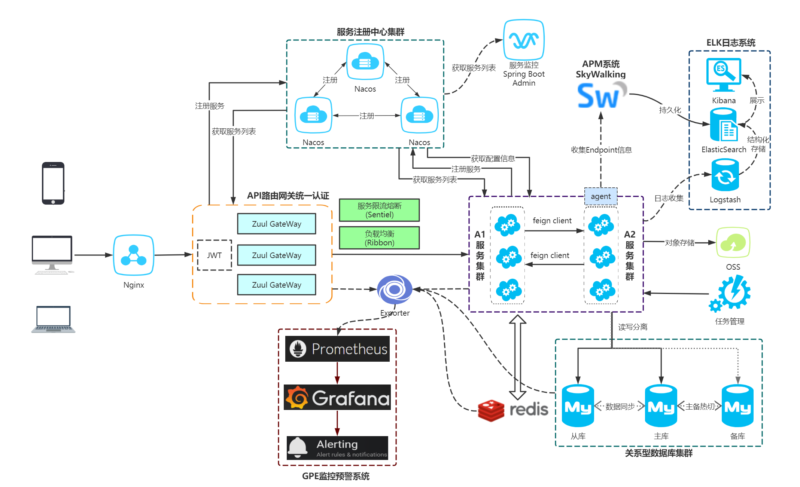

# 部署
```lua
nohup java -jar target/sc-gateway.jar >> /home/log/sc-gateway-$(date +%Y-%m-%d).log 2>&1 &
nohup java -jar pipe-uaa/target/pipe-uaa.jar  >> /home/log/uaa-$(date +%Y-%m-%d).log 2>&1
nohup java -jar pipe-business/user-center/target/user-center.jar   >> /home/log/user-center-$(date +%Y-%m-%d).log 2>&1
nohup java -jar pipe-business/ops-center/target/ops-center.jar  >> /home/log/ops-center-$(date +%Y-%m-%d).log 2>&1 &
nohup java -jar pipe-business/device-center/target/device-center.jar  >> /home/log/device-center-$(date +%Y-%m-%d).log 2>&1 &
nohup java -jar pipe-business/assets-center/target/assets-center.jar  >> /home/log/assets-center-$(date +%Y-%m-%d).log 2>&1 &
```


项目账号密码
  * 账号密码：admin/admin
  * APM监控账号密码：admin/admin
  * Grafana账号：pipe/pipe123
  
  
  特点
* 前后端分离的企业级微服务架构
* 主要针对解决微服务和业务开发时常见的**非功能性需求**
* 深度定制`Spring Security`真正实现了基于`RBAC`、`jwt`和`oauth2`的无状态统一权限认证的解决方案
* 提供应用管理，方便第三方系统接入，**支持多租户(应用隔离)**
* 引入组件化的思想实现高内聚低耦合并且高度可配置化
* 注重代码规范，严格控制包依赖，每个工程基本都是最小依赖


```lua
pipe-platform -- 父项目，公共依赖
│  ├─pipe-business -- 业务模块一级工程
│  │  ├─user-center -- 用户中心[7000]
│  │  ├─file-center -- 文件中心[5000]
│  │  ├─device-center -- 设备中心[7202]
│  │  ├─ops-center -- 运维中心[7201]
│  │  ├─assets-center -- 资产中心[7203]
│  │  ├─code-generator -- 代码生成器[7300]
│  │  ├─search-center -- 搜索中心
│  │  │  ├─search-client -- 搜索中心客户端
│  │  │  ├─search-server -- 搜索中心服务端[7100]
│  │  ├─sso-center -- 搜索中心
│  │  │  ├─web-sso -- sso前端
│  │  │  ├─ss-sso -- sso单点登录
│  │─pipe-commons -- 通用工具一级工程
│  │  ├─pipe-auth-client-spring-boot-starter -- 封装spring security client端的通用操作逻辑
│  │  ├─pipe-common-core -- 封装通用操作逻辑
│  │  ├─pipe-common-spring-boot-starter -- 封装通用操作逻辑
│  │  ├─pipe-db-spring-boot-starter -- 封装数据库通用操作逻辑
│  │  ├─pipe-log-spring-boot-starter -- 封装log通用操作逻辑
│  │  ├─pipe-redis-spring-boot-starter -- 封装Redis通用操作逻辑
│  │  ├─pipe-ribbon-spring-boot-starter -- 封装Ribbon和Feign的通用操作逻辑
│  │  ├─pipe-sentinel-spring-boot-starter -- 封装Sentinel的通用操作逻辑
│  │  ├─pipe-swagger2-spring-boot-starter -- 封装Swagger通用操作逻辑
│  ├─pipe-config -- 配置中心
│  ├─pipe-gateway -- api网关一级工程
│  │  ├─sc-gateway -- spring-cloud-gateway[9900]
│  ├─pipe-monitor -- 监控一级工程
│  │  ├─sc-admin -- 应用监控[6500]
│  │  ├─log-center -- 日志中心[7200]
│  ├─pipe-uaa -- spring-security认证中心[8000]
│  ├─pipe-register -- 注册中心Nacos[8848]

```


### 架构图
 


二、访问后端api需带上token
```lua
放header方式：
Authorization:Bearer xxx
​
放参数方式：
http://localhost:9900/api-user/users?access_token=xxx
```

三、后端api方法不做认证方式
```lua
pipe:
  security:
    ignore:
      httpUrls: '不想认证拦截的url'
```

四、获取当前登录人对象
```lua
请求的方法参数SysUser上添加该注解，则注入当前登录人信息
//例1：只有id、username 和 roles
public void test(@LoginUser SysUser user)
​
//例2：能获取SysUser对象的所有信息
public void test(@LoginUser(isFull = true) SysUser user)
```

swagger在那里个地址
统一通过网关访问：http://127.0.0.1:9900/swagger-ui.html

